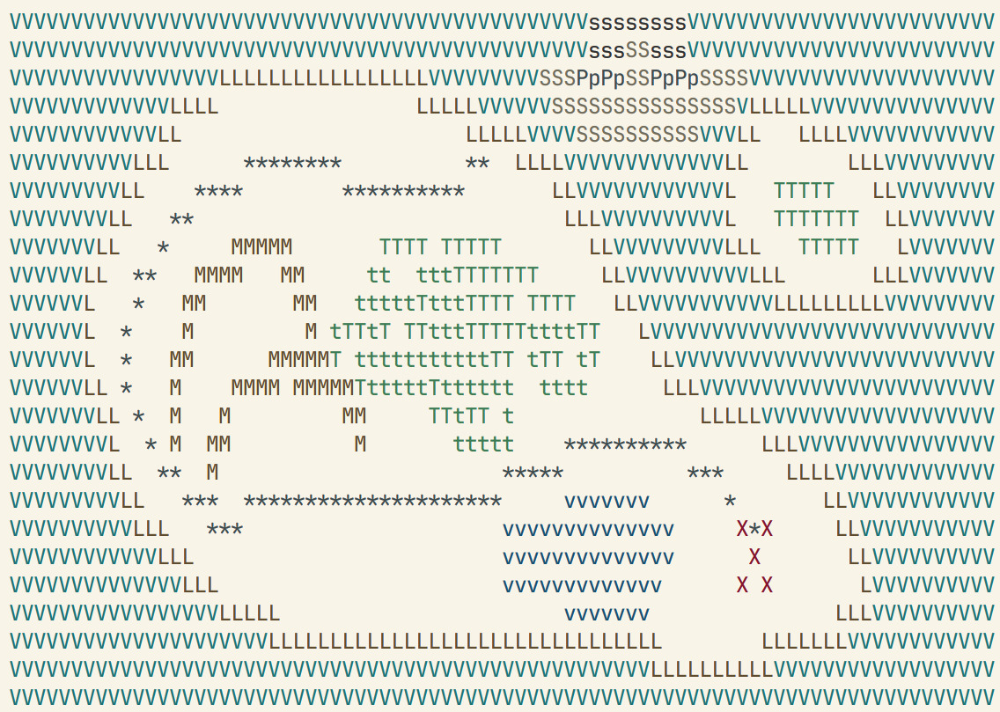
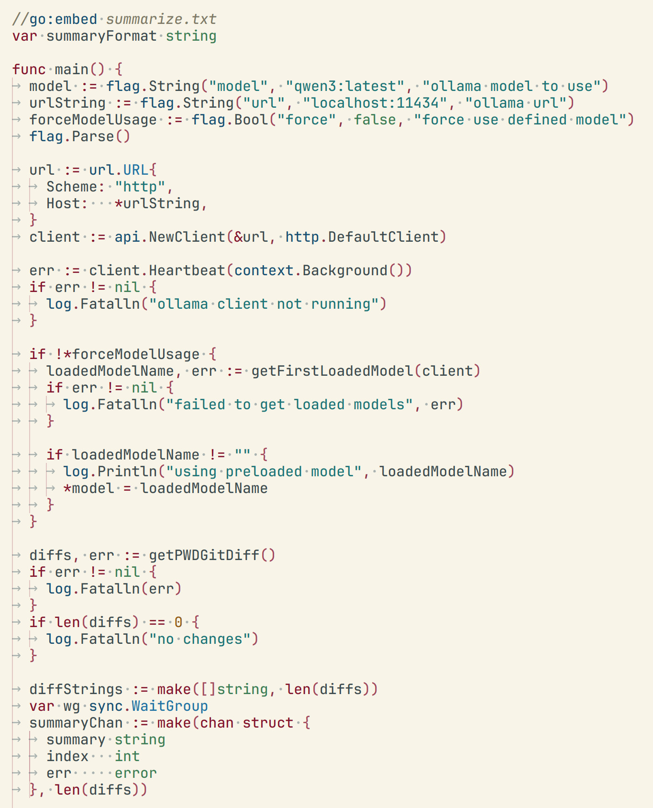

# Pirate Map VS Code Theme (Golang, Typescript)

Ahoy, matey! Welcome to Pirate Map, a Visual Studio Code theme for those who navigate the treacherous seas of code.

This theme be a modification of thy Solarized Light theme, but with a twist worthy of Blackbeard himself. We've plundered the treasure chest of colors and selected a palette of muted pastels - no harsh hues to send ye blind or distract ye from yer precious booty. The result be a theme that's easy on the eyes, gentle as a calm sea, without too many blasted colors to pull ye off course from yer coding treasure hunt. Arrr, may this theme serve ye well on yer digital adventures!

## Features

* Muted Pastel Colors: A carefully selected color palette that is easy on the eyes and reduces strain during long coding sessions.
* Solarized Light Fork: Based on the popular and time-tested Solarized Light theme.
* Optimized for Readability: Syntax highlighting is designed to be clear and consistent, making your code easy to read and understand.

Use `./vscode-install.sh` to install and test locally.
